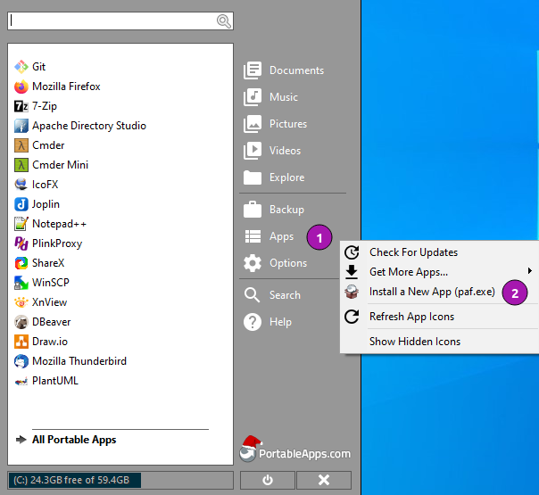
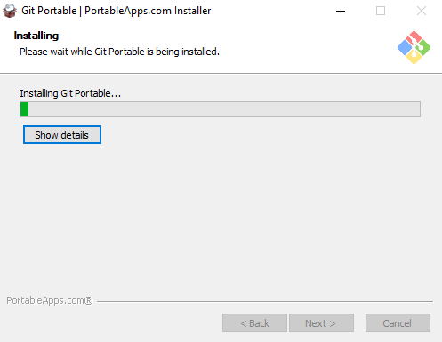

[](https://github.com/uroesch/ApacheJMeterPortable/actions?query=workflow%3Abuild-package)
[](https://github.com/uroesch/ApacheJMeterPortable/releases)
[](#runtime-dependencies)
[](#runtime-dependencies)


# Apache JMeter Portable for PortableApps.com


The [Apache JMeter™](https://jmeter.apache.org/) application is open source
software, a 100% pure Java application designed to load test functional
behavior and measure performance. It was originally designed for testing 
Web Applications but has since expanded to other test functions.
What can I do with it?

Apache JMeter may be used to test performance both on static and dynamic 
resources, Web dynamic applications. It can be used to simulate a heavy 
load on a server, group of servers, network or object to test its strength
or to analyze overall performance under different load types.

## Runtime dependencies
* 32-bit or 64-bit version of Windows.
* 32-bit Java on 32-bit Windows e.g.
  [OpenJDK JRE](https://portableapps.com/apps/utilities/OpenJDKJRE),
  [OpenJDK](https://portableapps.com/apps/utilities/OpenJDK),
  [JRE](https://portableapps.com/apps/utilities/java_portable) or
  [JDK](https://portableapps.com/apps/utilities/jdkportable) 
* 64-bit Java on 64-bit Windows e.g.
  [OpenJDK JRE 64](https://portableapps.com/apps/utilities/OpenJDKJRE64),
  [OpenJDK 64](https://portableapps.com/apps/utilities/OpenJDK64),
  [JRE 64](https://portableapps.com/apps/utilities/java_portable_64) or
  [JDK 64](https://portableapps.com/apps/utilities/jdkportable64) 

## Support matrix

| OS              | 32-bit             | 64-bit              | 
|-----------------|:------------------:|:-------------------:|
| Windows XP      | ![ns][ns]          | ![ns][ns]           | 
| Windows Vista   | ![ps][ps]          | ![ps][ps]           | 
| Windows 7       | ![fs][fs]          | ![ps][ps]           |  
| Windows 8       | ![ps][ps]          | ![ps][ps]           |  
| Windows 10      | ![fs][fs]          | ![fs][fs]           |

Legend: ![ns][ns] not supported;  ![nd][nd] no data; ![ps][ps] supported but not verified; ![fs][fs] verified;
  
## Status 
This project is in early beta stage. 

## Todo
- [ ] Documentation
- [ ] Replace Icons

<!-- Start include INSTALL.md -->
## Installation

### Install via the PortableApps.com Platform

After downloading the `.paf.exe` installer navigate to your PortableApps.com Platform
`Apps` Menu &#10102; and select `Install a new app (paf.exe)` &#10103;. 



From the dialog choose the previously downloaded `.paf.exe` file. &#10104; 


After a short while the installation dialog will appear. 




### Install outside of the PortableApps.com Platform

The Packages found under the release page are not digitally signed so there the installation
is a bit involved.

After downloading the `.paf.exe` installer trying to install may result in a windows defender
warning.


To unblock the installer and install the application follow the annotated screenshot below.


1. Right click on the executable file.
2. Choose `Properties` at the bottom of the menu.
3. Check the unblock box.
<!-- End include INSTALL.md -->

<!-- Start include BUILD.md -->
### Build

#### Windows 10

To build the installer run the following command in the root of the git
repository.

```
powershell -ExecutionPolicy ByPass -File Other/Update/Update.ps1
```

#### Linux (Docker)

Note: This is currently the preferred way of building.

For a Docker build run the following command.

```
curl -sJL https://raw.githubusercontent.com/uroesch/PortableApps/master/scripts/docker-build.sh | bash
```

#### Linux (Wine)

To build the installer under Linux with Wine and PowerShell installed run the
command below.

```
pwsh Other/Update/Update.ps1
```
<!-- End include BUILD.md -->


[nd]: Other/Icons/no_data.svg
[ns]: Other/Icons/no_support.svg
[ps]: Other/Icons/probably_supported.svg
[fs]: Other/Icons/full_support.svg
